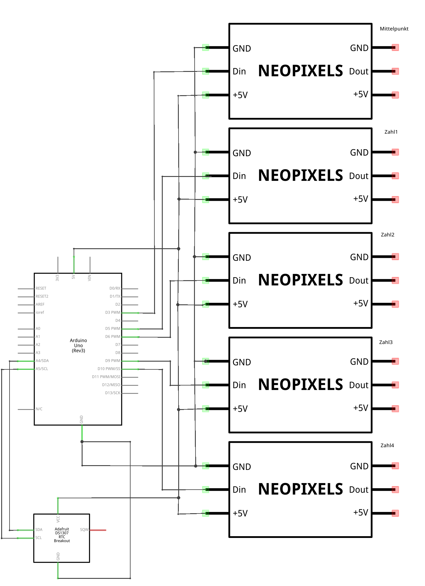
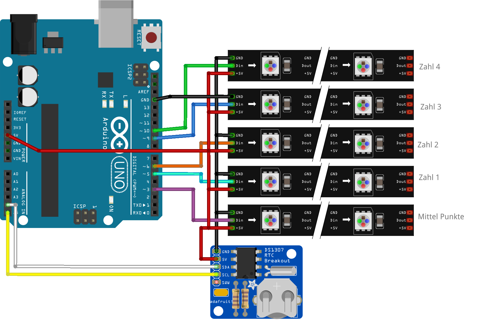
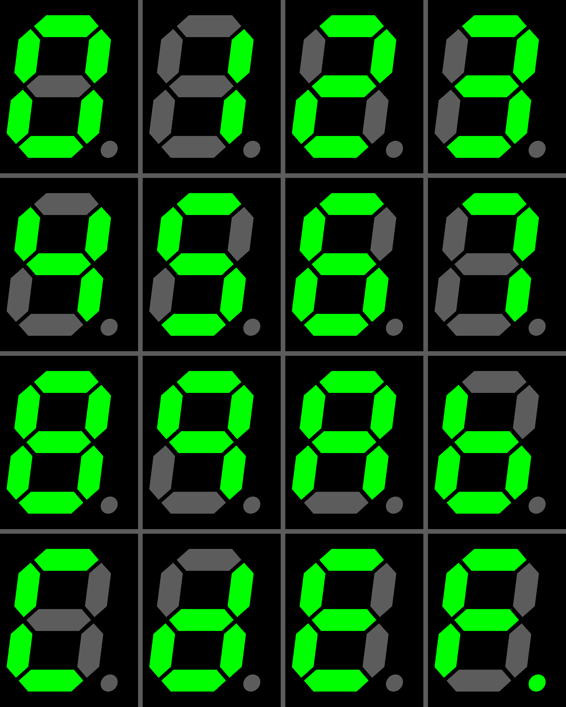
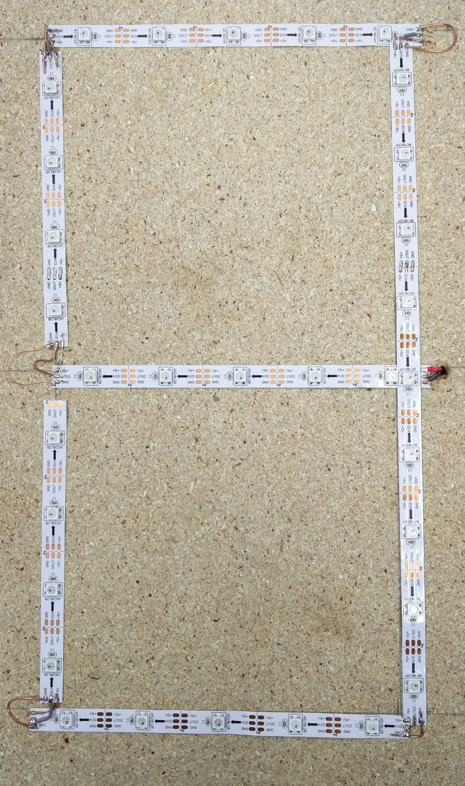
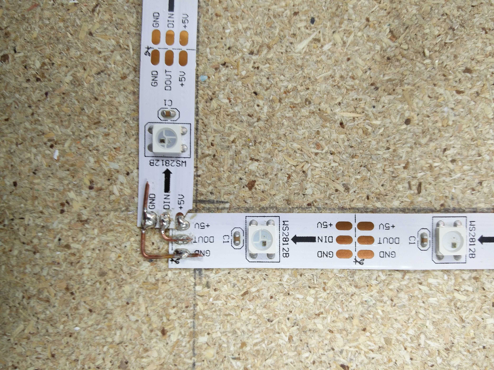

## 7 Segment Wand Uhr

Mit diesem Projekt haben wir eine Wanduhr Gebaut die mit vier 7-Segment-Displays die akutelle Uhrzeit in der Form einer Digital Uhr ausgibt.

Hardware:
* Arduino Uno (oder Klon)
* WS2812B LED Stripes (auch Neopixel genannt)
* DS1307 RTC (Real Time Clock) für die Uhrzeit
* Jumper Kabel
* Steckbrücken, Kupferdraht
* Materialen zum Löten
* Platte als Grundlage

### Elektronischer Aufbau

Steckverbindungen:

| Verbindunge Arduino | Verbindungen Elektronische Komponenten |
| -- | -- |
| IO 10 | Din Zahl 4|
| IO 9 | Din Zahl 3|
| IO 6 | Din Zahl 2|
| IO 5 | Din Zahl 1|
| IO 3 | Din Mittelpunkt|
| GND | GND LED Stripe |
| 5V | 5V LED Stripe |
| | | 
| A4 (SDA) | SDA DS1307 |
| A5 (SCL | SCL DS1307 |
| 5V | 5V DS1203 |
| GND | GND DS1203 |

### Ein 7-Segment-Display mit den WS1212b bauen

Ein 7-Segment-Display besteht vereinfacht gesagt aus 7 verschieden "Streifen" aus denen alle Zahlen von 0-9 aus unserem Zahlensystem einfach dargestellt werden können. Wie die einzelnen Zahlen ausseht, seht ihr hier:

Bild Quelle:
https://commons.wikimedia.org/wiki/File:Seven_segment_display-gallery.png

Genau das können wir auch mit den WS2812B Stripes nachbauen und das sieht dann ungefähr so aus:

Wichtig ist hierbei das bei jedem Steifen Din (Data in) mit dem voherigen Dout (Data out) verbunden wird. So ist jewals ein 7-Segment-Display ein langer verbundener LED Stripe. Diese Verbidung lassen sich mittels Löten herstellen. Dafür ist es am besten wenn die LED Stripes in einem 90° Winkel legen. Deswegen messt zuerst welche Längen von Streifen einen 90° Winkel erzeugen bevor ihr euch für die Größe Entscheidet. Eine gutes Beispiel ist diese Verbindung:

