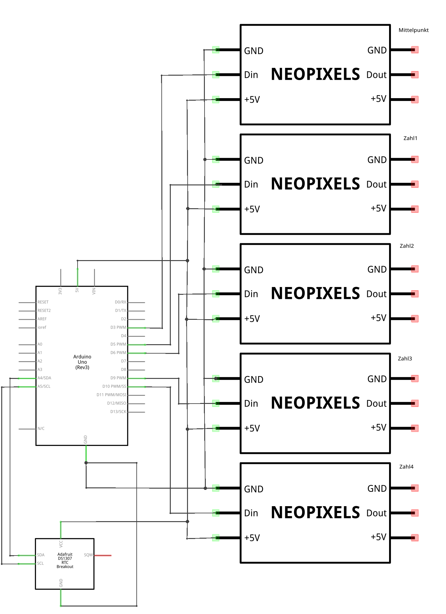

## 7 Segment Wand Uhr

Mit diesem Projekt haben wir eine Wanduhr Gebaut die mit vier 7-Segment-Displays die akutelle Uhrzeit in der Form einer Digital Uhr ausgibt.

Hardware:
* Arduino Uno (oder Klon)
* WS2812B LED Stripes (auch Neopixel genannt)
* DS1307 RTC (Real Time Clock) für die Uhrzeit
* Jumper Kabel
* Steckbrücken, Kupferdraht
* Materialen zum Löten
* Platte als Grundlage

### Elektronischer Aufbau

Steckverbindungen:

| Verbindunge Arduino | Verbindungen Elektronische Komponenten |
| -- | -- |
| IO 10 | Din Zahl 4|
| IO 9 | Din Zahl 3|
| IO 6 | Din Zahl 2|
| IO 5 | Din Zahl 1|
| IO 3 | Din Mittelpunkt|
| GND | GND LED Stripe |
| 5V | 5V LED Stripe |
| | | 
| A4 (SDA) | SDA DS1307 |
| A5 (SCL | SCL DS1307 |
| 5V | 5V DS1203 |
| GND | GND DS1203 |

### Ein 7-Segment-Display mit den WS1212b bauen

